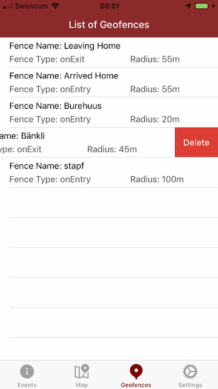
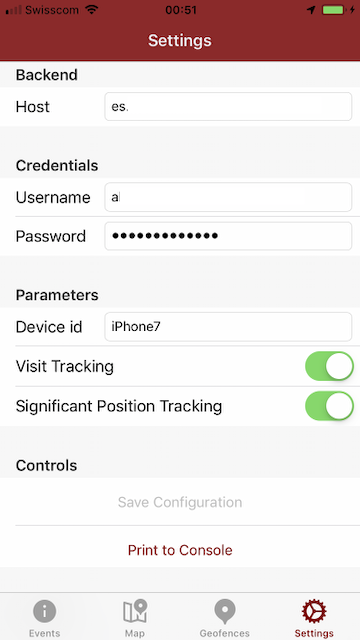

# My LBS Project

## Idea

Leveraging all three LBS modules from the Apple iOS ecosystem.

- Most significant position tracking
- Visited places (if one stays a moment on the same location)
- Geofences (good for time tracking when you have arrived in the office and when you have left it)

The main challenge was to get used to the iOS ecosystem. Since it was the first iOS App I have created it took me endless hours of finding out how things work.

Further features:

- All data is persitet as JSON (Done with Swift Codables)
- Entries can be deleted and saved again
- Only low energy modes are used
- User can select which modes should be used

Next steps

- Anything is now ready to push LBS infos to a server. In this case, I prefer Elasticsearch. Together with Kibana all the data can be easily analyzed then.

## Screen shots

### Overview of LBS events

 

### Map showing registerd Geofences


### View for adding new Geofences

 

### List of created Geofences

 

### Settings view with mini console

 

## JSON examples

### Settings

```json
{
    "password": "demo",
    "username": "hansli",
    "deviceId": "iPhone7",
    "host": "somehost.somedomain.sometld",
    "visitTrackingEnabled": true,
    "significantPositionTrackingEnabled": true
}
```

### Geofences

```json
[
    {
        "radius": 55,
        "note": "Leaving Home",
        "longitude": 7.42556546995361,
        "eventType": "On Exit",
        "latitude": 46.921031748866291,
        "identifier": "82E2BD78-19D2-4D45-A2E5-8AD698B4A05A",
        "dateTime": "2019-07-03T20:59:16+0200"
    },
    {
        "radius": 55,
        "note": "Arrived Home",
        "longitude": 7.4255992517141074,
        "eventType": "On Entry",
        "latitude": 46.921014749746149,
        "identifier": "F481F2EB-275B-4F8A-B5C9-1AC7049505AA",
        "dateTime": "2019-07-03T21:00:19+0200"
    }
]
```

### Events

#### Geofence Events

```json
[
    {
        "longitude": 7.4255992517141074,
        "eventType": "On Entry",
        "latitude": 46.921014749746149,
        "isUploaded": false,
        "addedDate": "2019-07-03T22:41:26.081+0200",
        "eventClassType": "Geofence Event",
        "name": "Arrived Home",
        "activityDate": "2019-07-03T22:41:26+0200"
    },
    {
        "longitude": 7.42556546995361,
        "eventType": "On Exit",
        "latitude": 46.921031748866291,
        "isUploaded": false,
        "addedDate": "2019-07-03T22:28:10.845+0200",
        "eventClassType": "Geofence Event",
        "name": "Leaving Home",
        "activityDate": "2019-07-03T22:28:10+0200"
    }
]
```

#### Visit Events

```json
[
    {
        "addedDate": "2019-07-03T22:46:14.715+0200",
        "longitude": 7.4252741396142765,
        "horizontalAccuracy": 64,
        "departureDate": "2019-07-03T22:53:43+0200",
        "latitude": 46.920821141526055,
        "duration": 62530024728.006714,
        "isUploaded": false,
        "eventClassType": "Visit Event",
        "arrivalDate": "2019-07-03T22:41:11+0200",
        "name": "Visit"
    },
    {
        "addedDate": "2019-07-03T22:46:14.661+0200",
        "longitude": 7.4210439976063221,
        "horizontalAccuracy": 64,
        "departureDate": "2019-07-03T22:41:10+0200",
        "latitude": 46.920228909774131,
        "duration": 784.68862497806549,
        "isUploaded": false,
        "eventClassType": "Visit Event",
        "arrivalDate": "2019-07-03T22:28:06+0200",
        "name": "Visit"
    }
]
```

#### Position Events

```json
[
    {
        "speed": 1.08713698387146,
        "arrivalDate": "2019-07-03T22:44:33+0200",
        "isUploaded": false,
        "longitude": 7.4260146986533089,
        "latitude": 46.921094710549411,
        "verticalAccuracy": 3,
        "addedDate": "2019-07-03T22:44:33.152+0200",
        "eventClassType": "Position Event",
        "course": 145.9434523732223,
        "floor": 0,
        "altitude": 636.12501146743818,
        "name": "A position (at: 0)",
        "horizontalAccuracy": 6.0009062052606579
    },
    {
        "speed": 0.5755760669708252,
        "arrivalDate": "2019-07-03T22:31:33+0200",
        "isUploaded": false,
        "longitude": 7.4195024242574616,
        "latitude": 46.920484927009412,
        "verticalAccuracy": 3.1551496982574463,
        "addedDate": "2019-07-03T22:31:33.403+0200",
        "eventClassType": "Position Event",
        "course": -1,
        "floor": 0,
        "altitude": 528.78396530151372,
        "name": "A position (at: 0)",
        "horizontalAccuracy": 12.000000000000002
    }
]
```

## UI hierarchy


### Detail


